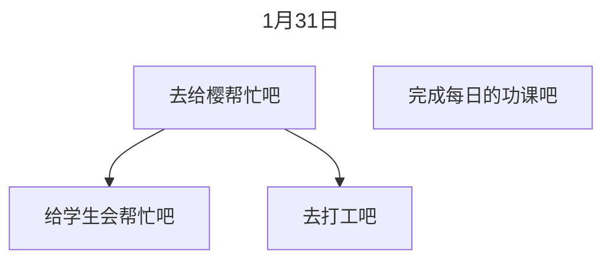
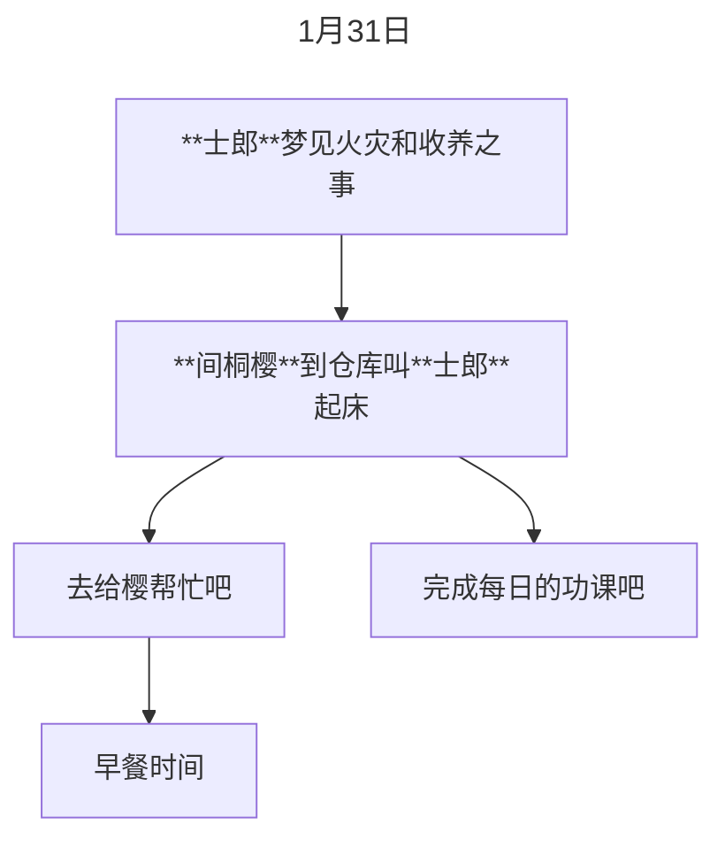

# 攻略

## 卫宫士郎

```mermaid
---
title: 1月31日
---
flowchart TD

A[去给樱帮忙吧] --> A11[给学生会帮忙吧]

A --> A12[去打工吧]

B[完成每日的功课吧]

```

# 故事线

## 卫宫士郎

### 流程图

```mermaid
---
title: 1月31日
---
flowchart TD

item1[**士郎**梦见火灾和收养之事] --> item2["**间桐樱**到仓库叫**士郎**起床"]

item2 --> event11[去给樱帮忙吧]
item2 --> event12[完成每日的功课吧]

event11 --> item3["早餐时间"]

```

### 文字

- 1月30日：士郎又梦见了当年的火灾和被卫宫切嗣收养的事，来到卫宫家的间桐樱到仓库叫醒士郎，随后樱就去厨房准备早餐了，而士郎换好了校服，【每日功课】，之后也来到了厨房，

