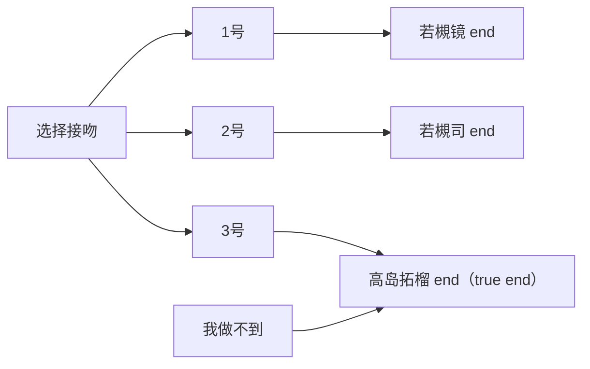
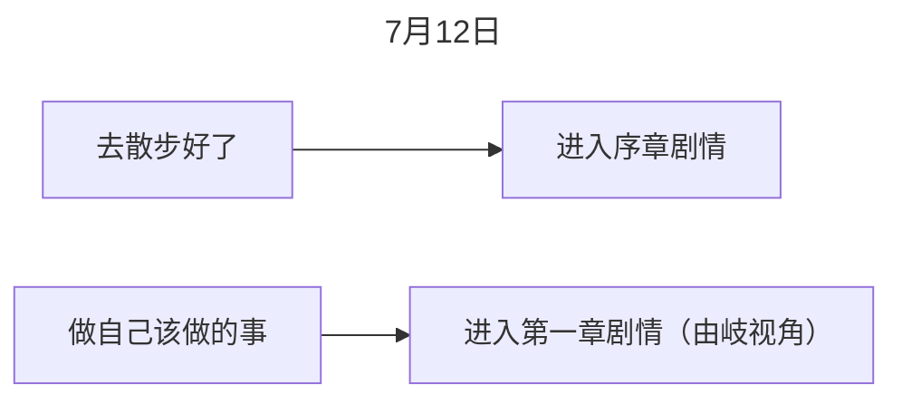
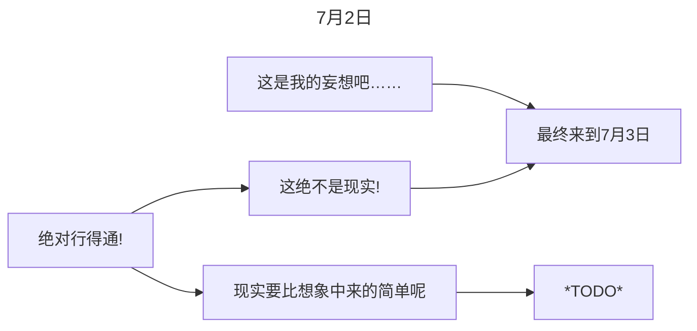
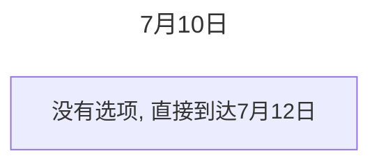

# 攻略

## 序章

## 水上由岐视角
在二周目开启，选择 **Down the Rabbit-Hole** 进入由岐视角

## 间宫卓司视角

# 故事线

## 序章

## 水上由岐视角

## 间宫卓司视角

- 7月2日：开场为间宫卓司搬书去秘密基地，在旧游泳池外被悠木皆守霸凌，霸凌之后遇到高岛拓榴，为了帮其躲避混混，将其带入了秘密基地，高岛拓榴将自己画漫画的note给了间宫卓司作为得知其秘密基地的交换条件。期间，间宫卓司对高岛拓榴产生了些许好感，同时也介绍了间宫卓司第一次表白失败的经历，以及在更早的时候受到山城等人的霸凌【工口部分：待补充】
- 7月3日：隔了一段时间，间宫卓司登录了自己管理的网站，发现xx（3班班主任）邀请了一个人进来，同时介绍了在一年前就有关于高岛拓榴被霸凌的帖子（参与人员为：橘希实香、赤坂惠、北见聪子）；后来出去给基地补充零食和饮料，在体育馆的时候遇到了若槻姐妹，她俩劝间宫卓司好好学习，一路劝到了高铁站（北校大部分学生都是坐高铁往返校的，若槻姐妹也是），而后分开，在间宫卓司回到旧游泳池的时候，恰好遇到从秘密基地出来的高岛拓榴，但是高岛拓榴很快就慌张地走掉了。期间，得知了若槻司有一个哥哥，并且小时候这个哥哥给了他一个和当时的司一样高的兔娃娃，那是司最珍贵的回忆。
- 7月10日：拓榴好久没来秘密基地，卓司在帖子中看到了不好的消息，于是想去找拓榴，结果在班级门口遇上了悠木皆守，被讨要了2万多，还被打了一顿，同时在场的城山等人去楼顶说悄悄话，而后卓司回忆起了一年前被城山等人欺负的回忆，以及第一次遇见悠木皆守时的情况（卓司成了悠木皆守的肥羊，因此城山等人都不敢欺负卓司）。卓司回到旧游泳池后发现拓榴在楼顶，于是跑去楼顶，却没有看见拓榴，只看见城山等人在聊毒品的事，卓司离开回到走廊时，疑似出现致幻现象
- 7月12日：卓司在外面买CD和动画，在某个大楼顶喝饮料，然后就睡到了下午，从楼顶往下看看见了水上由岐、高岛拓榴等人，分别之后，卓司也坐上回去的电车了，但是内心悸动，感觉不安，又回去沿着高岛拓榴的方向走去，然后目睹了三人跳楼的过程，打完救护车之后回到了秘密基地，又出现了致幻现象
- 7月13日：卓司疑似昨晚看见了致幻现场从秘密基地跑回来家里，早上来到教室之后确定了拓榴跳楼的事实，

# 人物

## 间宫卓司

家庭成员：
- 父亲：死于癌症
- 母亲：已故（根据间宫卓司的说法），原因未知。小时候经常虐待卓司，比如用热水泼卓司、把卓司浸到浴缸里、往卓司嘴里灌芥末等。并且有让卓司帮忙搭建网站，好像是传教用
- 妹妹：间宫羽咲（音同“笑”），存活

经历：
- 秘密基地：母亲不让卓司看动漫、漫画这类东西，一旦看到就会被销毁，因此卓司前前后后建立了17个秘密基地（因为很多次被母亲发现了），最后一个秘密基地就是北校的下水道
- 第一次表白失败：班长川端曾经多次和卓司聊起宅系话题，并且说过卓司像漫画主角一样帅，让卓司误以为班长喜欢他，于是有一次卓司告诉川端放学后有话想单独对她说。然而川端却带来好几个男女同学一起过来了，这几个人抢走并当场念诵卓司写的情书，并且将里面的内容解读成工口内容，对卓司进行了一顿羞辱，就连川端本人也说卓司“臭宅”、“恶心”之类的。这个经历使得卓司在后来基本不会敞开心扉和人聊自己喜欢的东西，认为是在这最后的下场就是被背叛，直到遇见了高岛拓榴。

# 名词

- DQN：[网络流行语](https://baike.baidu.com/item/%E7%BD%91%E7%BB%9C%E6%B5%81%E8%A1%8C%E8%AF%AD/4463690?fromModule=lemma_inlink)，来自日语发音的缩写“ドキュン”（读作dokyun，缩写为dqn），[贬义词](https://baike.baidu.com/item/%E8%B4%AC%E4%B9%89%E8%AF%8D/10918742?fromModule=lemma_inlink)，指[横蛮无理](https://baike.baidu.com/item/%E6%A8%AA%E8%9B%AE%E6%97%A0%E7%90%86/2116119?fromModule=lemma_inlink)、爱用暴力甚至反社会的人，或指缺乏常识、学历低下的人，如奇葩不良少年等。
- 1754年，达米安的故事：