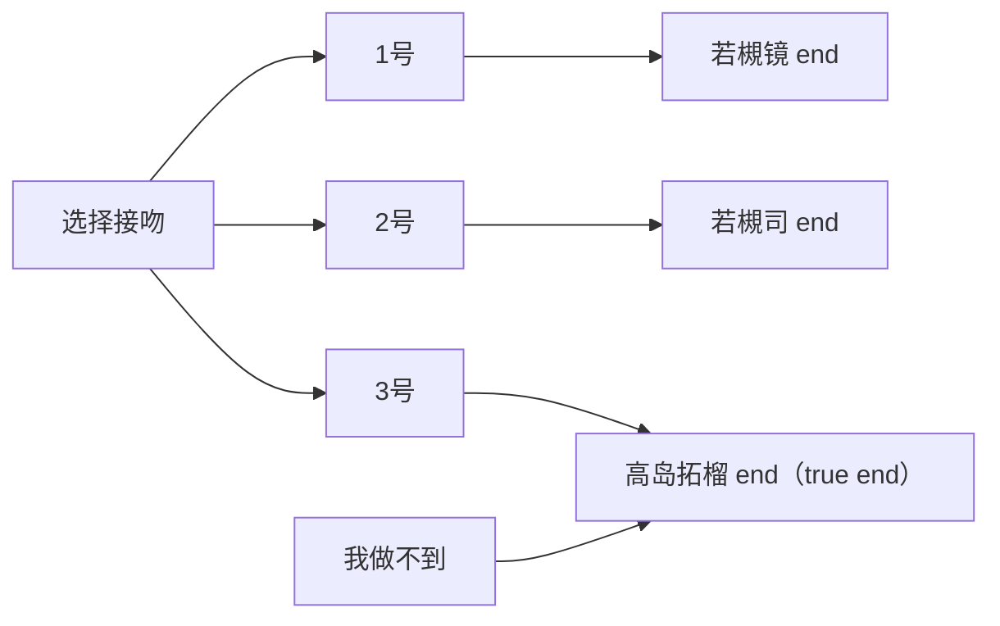
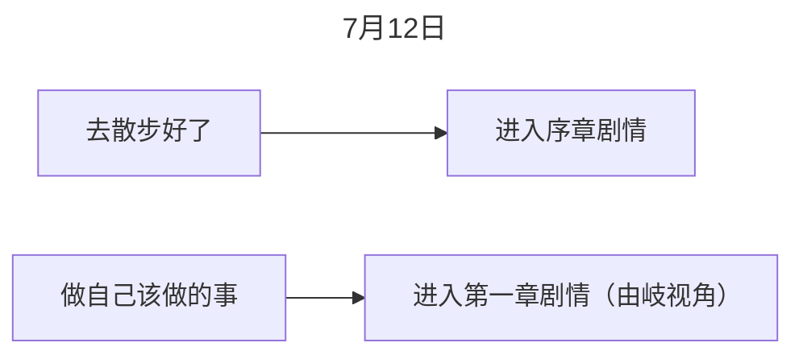

## 序章

```mermaid
flowchart LR

kiss[选择接吻] --> kiss1[1号] --> e1[若槻镜 end]

kiss --> kiss2[2号] --> e2[若槻司 end]

kiss --> kiss3[3号] --> e3["高岛拓榴 end（true end）"]

nokiss[我做不到] --> e3

```

## 由岐视角
在二周目开启，选择 **Down the Rabbit-Hole** 进入由岐视角

```mermaid
---
title: 7月12日
---
flowchart LR

 A[去散步好了] --> A1[进入序章剧情]

B[做自己该做的事] --> B1["进入第一章剧情（由岐视角）"]


```

